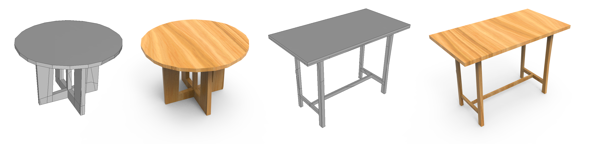

# BSP-NET-original
TensorFlow 1.15 implementation of [BSP-Net: Generating Compact Meshes via Binary Space Partitioning](https://arxiv.org/abs/1911.06971), [Zhiqin Chen](https://www.sfu.ca/~zhiqinc/), [Andrea Tagliasacchi](https://gfx.uvic.ca/people/ataiya/), [Hao (Richard) Zhang](https://www.cs.sfu.ca/~haoz/), along with other scripts used in our paper.

### [Paper](https://arxiv.org/abs/1911.06971)  |   [Oral video](https://youtu.be/9-ixexpjN-8)  |   [Project page](https://bsp-net.github.io)



## Other Implementations

- [original](https://github.com/czq142857/BSP-NET-original) (this repo)
- [TensorFlow 1.15 (Static graph)](https://github.com/czq142857/BSP-NET-tf1)
- [TensorFlow 2.0 (Eager execution)](https://github.com/czq142857/BSP-NET-tf2)
- [PyTorch 1.2](https://github.com/czq142857/BSP-NET-pytorch)

The difference between the original and the others are:

- The original contains other scripts based on TensorFlow 1.15, such as the toy experiment on 2D shapes, and the code for evaluations.
- The other implementations are more readable, and the batch sizes are different. The results are close or better than the original implementation.

## Citation
If you find our work useful in your research, please consider citing:

	@article{chen2020bspnet,
	  title={BSP-Net: Generating Compact Meshes via Binary Space Partitioning},
	  author={Zhiqin Chen and Andrea Tagliasacchi and Hao Zhang},
	  journal={Proceedings of IEEE Conference on Computer Vision and Pattern Recognition (CVPR)},
	  year={2020}
	}


## Dependencies
Requirements:
- Python 3.6 with numpy, h5py and Cython
- [TensorFlow 1.15](https://www.tensorflow.org/install)
- [PyMCubes](https://github.com/pmneila/PyMCubes) (for marching cubes)


## Datasets and pre-trained weights
The original voxel models are from [HSP](https://github.com/chaene/hsp). The rendered views are from [3D-R2N2](https://github.com/chrischoy/3D-R2N2).

Since our network takes point-value pairs, the voxel models require further sampling.

For data preparation, please see [point_sampling](https://github.com/czq142857/IM-NET/tree/master/point_sampling) in [IM-NET](https://github.com/czq142857/IM-NET).


We provide the ready-to-use datasets in hdf5 format.

- [All categories in one hdf5 file](https://drive.google.com/open?id=19ZRGnDP0-gus7aaEm2hTaLsXRg_5VKFH)
- [In individual hdf5 files](https://drive.google.com/open?id=1V2UpXoITil8ugjniBkNSgyWqv6bDiGM-)

Backup links:

- [All categories in one hdf5 file](https://pan.baidu.com/s/1s-mHjq7YYcPQ099t2IHHZA) (pwd: ivxi)
- [In individual hdf5 files](https://pan.baidu.com/s/1JCS3qxGgJ9SXnbwG_iYw_Q) (pwd: benj)

We also provide the pre-trained network weights.

- [BSP-NET-original.zip](https://drive.google.com/open?id=1Bw7h9hWdqbh7_RtZNTjIjKIQD01vsYm4)

Backup links:

- [BSP-NET-original.zip](https://pan.baidu.com/s/11zUpN6G5vA4vO75bcPoJ0Q) (pwd: 50ee)


## Usage

First, make sure you have Cython installed and then build *bspt* module with
```
python setup.py build_ext --inplace
```
The *bspt* module is for recovering meshes from BSP-trees.
If you fail to build the module, you can replace *"from bspt import ..."* with *"from bspt_slow import ..."* in all codes.
*bspt_slow.py* is written in python and slower than the Cython implementation.


Please use the provided scripts *train_ae.sh*, *train_svr.sh*, *test_ae.sh*, *test_svr.sh* to train the network on the training set and get output meshes for the testing set.

To train an autoencoder, use the following commands for progressive training. 
```
python main.py --ae --train --phase 0 --iteration 8000000 --sample_dir samples/all_vox256_img0_16 --sample_vox_size 16
python main.py --ae --train --phase 0 --iteration 8000000 --sample_dir samples/all_vox256_img0_32 --sample_vox_size 32
python main.py --ae --train --phase 0 --iteration 8000000 --sample_dir samples/all_vox256_img0_64 --sample_vox_size 64
python main.py --ae --train --phase 1 --iteration 8000000 --sample_dir samples/all_vox256_img1 --sample_vox_size 64
```
The above commands will train the AE model 8000000 iterations on 16<sup>3</sup>, 32<sup>3</sup>, 64<sup>3</sup> resolution each, for phase 0 (continuous phase); and 8000000 iterations on 64<sup>3</sup> resolution, for phase 1 (discrete phase).

After training on each resolution, you may visualize some results from the testing set.
```
python main.py --ae --phase 0 --sample_dir samples/all_vox256_img0_16 --start 0 --end 16
python main.py --ae --phase 0 --sample_dir samples/all_vox256_img0_32 --start 0 --end 16
python main.py --ae --phase 0 --sample_dir samples/all_vox256_img0_64 --start 0 --end 16
python main.py --ae --phase 1 --sample_dir samples/all_vox256_img1 --start 0 --end 16
```
You can specify the start and end indices of the shapes by *--start* and *--end*. Note that you need to choose the phase correctly according to which phase the model was trained on.


To train the network for single-view reconstruction, after training the autoencoder, use the following command to extract the latent codes:
```
python main.py --ae --getz
```
Then use the following commands to train the SVR model and get some samples:
```
python main.py --svr --train --epoch 1000 --sample_dir samples/all_vox256_img2
python main.py --svr --sample_dir samples/all_vox256_img2 --start 0 --end 16
```
Training an AE model then SVR model on the 13 categories takes about 6 days on one GeForce RTX 2080 Ti GPU.

### Training options

You can use *--phase N* to specify which phase the network will be trained on.
- phase 0 : continuous for better convergence
- phase 1 : hard discretization for BSP
- phase 2 : hard discretization for BSP with L<sub>overlap</sub>
- phase 3 : soft discretization for BSP (gradually push the continuous weights towards binary via a loss term). This phase produces better results for shape reconstruction.

You can train the network on *phase 0 → phase 1* or *phase 0 → phase 2* or *phase 0 → phase 3*.


### Testing options

You can use different testing functions provided in *main.py*:
- *bsp_ae.test_dae3(FLAGS)* : output meshes obtained by *marching cubes* as ply format
- *bsp_ae.test_bsp(FLAGS)* : output meshes as ply format
- *bsp_ae.test_mesh_point(FLAGS)* : output meshes and point clouds (sampled on the shape surface) as ply format
- *bsp_ae.test_mesh_obj_material(FLAGS)* : output meshes as obj format with a shared material file; you can visualize part correspondences by changing the colors in that material file


The default output mesh is not watertight - adjacent polygons do not share their vertices and edges. You can enable watertight outputs by replacing function *get_mesh* with *get_mesh_watertight* in the testing functions.
Function *get_mesh_watertight* will merge nearby vertices for each convex to make all convexes watertight.


You can also remove convexes that are inside the shape. Removing those "inside" convexes has very little impact on the visual appearance of the shapes (because those "inside" convexs are not visible), which is reflected by Light Field Distance (*2939.15 → 2937.16*). But removing them has a huge impact on Chamfer Distance (*0.001432 → 0.001548*).
In function *test_mesh_point* those "inside" convexes are kept; in other testing functions they are removed. Check the code for implementation details.


## Code for 2D experiments

Please find the code in [bsp_2d](https://github.com/czq142857/BSP-NET-original/tree/master/bsp_2d).

## Evaluation

Our code for computing Chamfer Distance and Normal Consistency can be found at [evaluation](https://github.com/czq142857/BSP-NET-original/tree/master/evaluation).

The Light Field Distance (LFD) is produced by [LightField descriptor](https://github.com/Sunwinds/ShapeDescriptor/tree/master/LightField/3DRetrieval_v1.8/3DRetrieval_v1.8).

Note that [the code for LightField descriptor](https://github.com/Sunwinds/ShapeDescriptor/tree/master/LightField/3DRetrieval_v1.8/3DRetrieval_v1.8) is written in C and the executable only does closest shape retrieval according to the Light Field Distance. If you want to use it in your own experiments, you might need to change some lines to get the actual distance and recompile the code.


## License
This project is licensed under the terms of the MIT license (see LICENSE for details).


